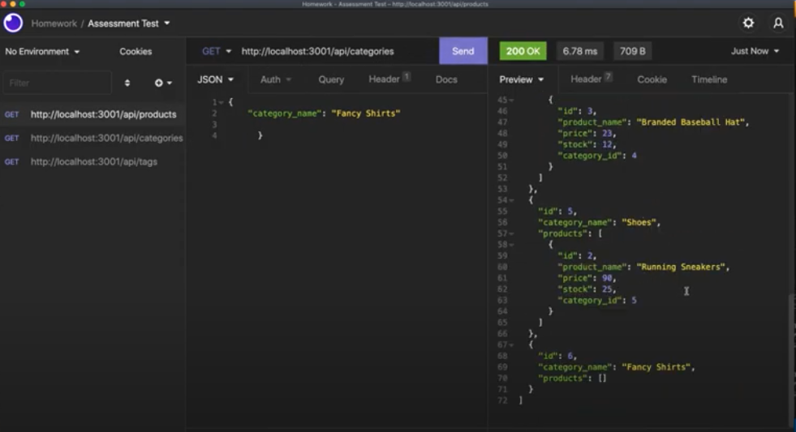

# 13 E-Commerce-Back-End

This week's homework involved connecting and organsing the back end of a fake E-commerce store. This app was created in node.js with Express.js, mysql, Sequelize and tested in Insomnia. A video walkthrough can be found below.

## User Story
```
AS A manager at an internet retail company
I WANT a back end for my e-commerce website that uses the latest technologies
SO THAT my company can compete with other e-commerce companies
```

## Acceptance Criteria
```
GIVEN a functional Express.js API
WHEN I add my database name, MySQL username, and MySQL password to an environment variable file
THEN I am able to connect to a database using Sequelize
WHEN I enter schema and seed commands
THEN a development database is created and is seeded with test data
WHEN I enter the command to invoke the application
THEN my server is started and the Sequelize models are synced to the MySQL database
WHEN I open API GET routes in Insomnia for categories, products, or tags
THEN the data for each of these routes is displayed in a formatted JSON
WHEN I test API POST, PUT, and DELETE routes in Insomnia
THEN I am able to successfully create, update, and delete data in my database
```

### Video Walkthough:

This application is not deployed so here is a video walkthrough:

[Homework 13 ORM: 13 E-Commerce-Back-End on YouTube](https://youtu.be/m6kLeathsoI)

## Screenshot of Running Application

The following screenshot is of the testing in Insomnia:

